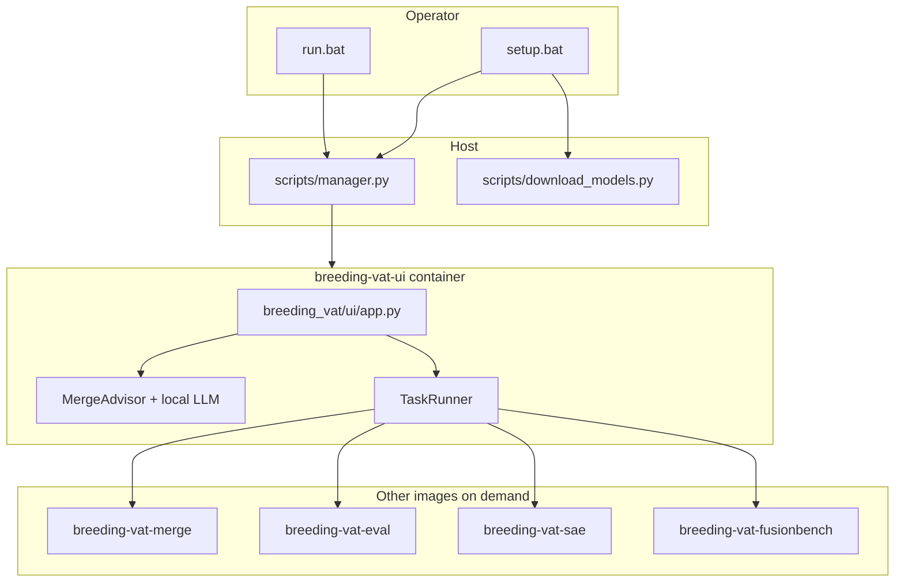

# Breeding Vat — Source of Truth (living document)

**Purpose:** One place that states what actually runs, how it connects, and what is historical or off-spine. When `Map.json`, `Architecture.md`, `CLAUDE.md`, or `system_state.txt` disagree with this file, **verify on disk** then update **this** document (or fix the code if the doc was right).

**How to use:** Read this first for entrypoints and wiring. Use `Map.json` for file inventory, `Architecture.md` for narrative design, `CLAUDE.md` for session constraints and roadmap.

---

## 1. Canonical operator entrypoints (Windows)

| Action | Command | Notes |
|--------|---------|--------|
| First-time / repair env | `setup.bat` | Calls `python scripts/manager.py setup` — creates dirs, builds missing Docker images, runs model download script, cleans old labeled containers. |
| Daily launch | `run.bat` | Requires Docker daemon; calls `python scripts/manager.py run` — ensures dirs, starts UI container, tails logs. |
| Status only | `status.bat` | Docker + images + containers; does not call `manager.py`. |

**Truth rule:** Alternate flows under `docker/` (compose, `dev.bat`, etc.) may exist; **the product default** for operators is **root `setup.bat` / `run.bat` → `scripts/manager.py`**.

---

## 2. Infrastructure spine (`scripts/manager.py`)

- **Images built and used:** `breeding-vat-ui`, `breeding-vat-merge`, `breeding-vat-eval`, `breeding-vat-sae`, `breeding-vat-fusionbench` (see `REQUIRED_IMAGES` in `manager.py`). **`Dockerfile.finetune` exists but is not in `REQUIRED_IMAGES`** — no image build for it in the default setup path.
- **`run` / UI container:** mounts repo to `/app`, Docker socket, sets `HOST_PWD`, label `breeding_vat=true`, publishes `8501`, image `breeding-vat-ui:latest`.
- **`setup`:** also runs `scripts/download_models.py --preset recommended` (see §11).
- **CLI commands:** `setup`, `run`, `verify`, `rebuild`, `clean`, `reset` (see `manager.py` `__main__`).

Dockerfile facts drift in older docs: **`docker/Dockerfile.ui`** should be taken from the file on disk (e.g. base image tag), not assumed from `Map.json`.

---

## 3. Application spine — Streamlit (primary product)

| Item | Path |
|------|------|
| UI module | `breeding_vat/ui/app.py` |
| Container CMD | `streamlit run /app/breeding_vat/ui/app.py` (see `Dockerfile.ui`) |

### 3.1 Cold start (`init_system` in `app.py`)

Creates data dirs, then constructs:

- `TaskRunner` — `breeding_vat/orchestrator/runner.py` — Docker tasks, `HOST_PWD` for volume paths, applies `breeding_vat/data/schema.sql` to `breeding_vat/data/breeding.db`.
- `ExperimentManager` — `breeding_vat/modules/experiment_manager.py`.
- `AdvancedMerger(runner)` — `breeding_vat/modules/merge/merger.py` — MergeKit + FusionBench backends.
- `ModelTransfer(experiment_manager=exp_manager)` — local/HF model registration.

### 3.2 Top-level imports (modules the UI expects to load)

Declared at top of `app.py` (evolution, merge, SAE, ASSAY, benchmark/receipts, recipe executor, orchestrator). **If it is not imported here or used from here, it is not part of the default UI runtime.**  
**Note:** `from breeding_vat.modules.benchmark import ReceiptWriter` still executes `benchmark/__init__.py`, which imports additional benchmark symbols into the Streamlit process — see **§19.2**.

### 3.3 Main tabs (when `st.session_state.current_experiment` is set)

| Tab | UI label | Wired behavior (check `app.py` for details) |
|-----|----------|-----------------------------------------------|
| 1 | Evolution | Models, advisor recipe, `RecipeExecutor`, `EvolutionEngine` / `EvolutionWithLogging`, merge methods from sidebar, benchmarks / scope filter options. |
| 2 | Lineage | Genealogy tables/charts, **`ReceiptWriter`** over experiment root. |
| 3 | SAE | Mostly status/copy; **interactive SAE analysis is tab 5** (see below). |
| 4 | Methods | Reference copy for MergeKit vs FusionBench methods. |
| 5 | Analysis | **`SAEScopedAnalyzer`** (VRAM, analyze, frankenmerge-related controls). |
| 6 | Logs | Log viewing. |
| 7 | ASSAY | **`ASSAYAnalyzer`**, visualizations, downstream actions. |

**Label caveat:** Tab “SAE” vs “Analysis” — scoped analyzer runs under **Analysis**; keep this table in sync if tabs are renamed.

---

## 4. CLI (secondary surface)

| Item | Path |
|------|------|
| CLI module | `breeding_vat/cli.py` |
| Entry | `python -m breeding_vat.cli recipes …` |

**Scope:** `RecipeExecutor` only — list / validate / describe / “execute” (prints JSON configs; does not replace the full evolution loop in Streamlit). See docstring in `cmd_execute_recipe`.

---

## 5. Merge and Docker execution (how heavy work runs)

- **`AdvancedMerger`** routes to **`MergekitEngine` / `MergekitWrapper`** (`mergekit_engine.py`) and **`FusionBenchEngine`** (`fusionbench_engine.py`).
- **`MergekitEngine.run_merge`** invokes **`mergekit-yaml`** inside **`breeding-vat-merge`** with mounted `breeding_vat/configs`, `breeding_vat/data`, and HF cache (see `mergekit_engine.py`).
- **`FusionBenchEngine`** targets image **`breeding-vat-fusionbench:latest`**; Hydra-style CLI `python -m fusion_bench` with modelpool YAML on disk (merge-only path uses `taskpool=dummy` in builder overrides — see `fusionbench_engine.py`).
- **`TaskRunner.run_docker_task`** is the generic `docker run --rm` wrapper used by the app for sibling containers (Docker-out-of-Docker from the UI container).

---

## 6. Data and artifacts (typical layout)

| Path | Role |
|------|------|
| `breeding_vat/data/experiments/<exp_name>/` | Per-experiment root: `merged_models/`, `logs/`, `configs/`, `results/`, `master_log` path in metadata (see `ExperimentManager.create_experiment`). |
| `breeding_vat/data/experiments/<exp_name>/receipts/` | Immutable merge receipts (`ReceiptWriter`); listed in Lineage tab. |
| `breeding_vat/data/model_zoo/` | Downloaded + registered models; also contains **large third-party trees** (e.g. vendored `llama.cpp`); not all Python there is Breeding Vat app code. |
| `breeding_vat/data/merged_models/` | Global merge output cache (MergeKit paths). |
| `breeding_vat/data/eval_results/` | Eval outputs. |
| `breeding_vat/data/templates/RECIPE_TEMPLATE.json` | Canonical recipe shape for `RecipeExecutor.load_template()`. |
| `breeding_vat/data/recipes/` | Saved recipe JSON files (`RecipeExecutor.RECIPES_DIR`). |
| `breeding_vat/configs/` | Generated merge YAML (e.g. `mergekit_*.yaml`). |
| `breeding_vat/data/breeding.db` | SQLite lineage (`TaskRunner` + `schema.sql`). |
| `breeding_vat/data/Prompts/` | Drop-in system prompt text files (referenced by docs / assistants; not all wired into `app.py`). |

---

## 7. Secondary references (not automatic truth)

| Document | Use |
|----------|-----|
| `Map.json` | File inventory, dependencies; **reconcile** commands/paths with repo. |
| `Architecture.md` | System narrative and flows; **reconcile** dates and API with `app.py`. |
| `CLAUDE.md` | Cursor/session constraints, roadmap, naming. |
| `system_state.txt` / `system_state.json` | Output of **System State Analyzer** (§12); machine snapshot; **can be stale** vs tree. |

**Reconciliation order:** (1) this file + code on disk, (2) `app.py` / `cli.py` / `manager.py`, (3) Dockerfiles, (4) other markdown / JSON.

---

## 8. Known off-spine or legacy (verify before relying on)

| Artifact | Issue / note |
|----------|----------------|
| `docker/task-runner.py` | Imports `breeding_vat.modules.merge.runner`, `eval.runner`, `sae.runner`, `train.runner` — **those modules are not present**; merge image entrypoint is **`mergekit-yaml`**, not this script. **Legacy / unused.** |
| `docker/Dockerfile.finetune` | `ENTRYPOINT ["python", "/app/scripts/finetune_runner.py"]` but **`scripts/finetune_runner.py` is missing** from the repo. Image not built by `manager.py` anyway. |
| Gradio `app.py` under `breeding_vat/data/model_zoo/**` | Part of specimen/vendor trees, **not** the Breeding Vat UI. |
| `Dockerfile.mergekit` / fusioncore | Older image path; **current** manager list uses `Dockerfile.merge` for the merge image (see `manager.py`). |

(Add rows here as you discover more.)

---

## 9. Evolution and evaluation spine (in-process + containers)

| Module | Path | Role |
|--------|------|------|
| `EvolutionEngine` | `breeding_vat/modules/merge/evolution.py` | Main waterfall: uses **`AdvancedMerger`**, internal **`MergekitEngine`**, **`BenchmarkEvaluator`**, optional SCOPE pre-filter, **`advanced_toggles`** + recipe-driven `advanced` dict, genealogy hooks via `_experiment_manager` / `_current_experiment`. |
| `EvolutionWithLogging` | `breeding_vat/modules/evolution/evolution_with_logging.py` | Wraps `EvolutionEngine.run_waterfall(...)` (note parameter name **`cycles=`** in the inner call), writes `master_log`, updates experiment metadata, optional `progress_callback` for UI. |
| `BenchmarkEvaluator` | `breeding_vat/modules/benchmark/evaluator.py` | Invoked by evolution for lm-eval / tiered tasks in Docker (`breeding-vat-eval` image, `lm_eval` entrypoint — see `Dockerfile.eval`). |

---

## 10. Recipe system (UI + CLI + validation)

| Module | Path | Role |
|--------|------|------|
| `RecipeExecutor` | `breeding_vat/modules/recipe_executor.py` | Load/save template, validate, `build_evolution_config` / finetuning / ASSAY / advanced bridges. |
| `RecipeValidator` | `breeding_vat/modules/merge/recipe_validator.py` | Schema and bounds (including advanced toggles); used by UI recipe build and **`scripts/verify_advanced_toggles.py`**. |

**UI:** Evolution flow builds a recipe dict (e.g. `build_recipe_from_ui` in `app.py`) and validates via `RecipeExecutor` before running evolution.

**Advisor overlap:** `MergeAdvisor` (§16) produces **human-readable** merge guidance and parameter variants; the structured recipe JSON for `RecipeExecutor` still comes from UI state + `build_recipe_from_ui`, not from the advisor alone unless the user copies advisor output into workflow manually.

---

## 11. Model zoo download (`scripts/download_models.py`)

- **Invoked by:** `scripts/manager.py` during `setup` → `download_models.py --preset recommended`.
- **Destination:** `breeding_vat/data/model_zoo` (`ZOO_DIR`).
- **Behavior:** HuggingFace safetensors vs GGUF repos; GGUF quant preference order documented in file header.
- **Presets:** `recommended`, `baseline`, `advisors-only`, plus grouped `SPECIALIZED_MODELS` keys (`advisor`, `sae`, `reasoning`, `code`, `general`) — see file for authoritative list.

---

## 12. Developer and meta scripts (`scripts/` excluding `manager.py`)

| Script / folder | Role |
|-----------------|------|
| `scripts/state_analyzer/` | **System State Analyzer** — stdlib AST + Docker/doc scan; run `python scripts/state_analyzer/analyzer.py` from repo root. Default output name in README is `system_state.json`; repo may contain `.txt` if renamed. Feeds `review_recommendations`, `contradictions`, etc. **Not** used by `setup.bat` / `run.bat`. |
| `scripts/verify_advanced_toggles.py` | Dry-run validation for the 11 opt-in advanced toggles (no Docker). **Also** exposes logic the Streamlit “Verify advanced toggle wiring” button calls via `run_verification()`. |
| `scripts/sae_self_analysis.py` | Optional CLI wrapper around **`SAEScopedAnalyzer`** for local analysis / compare. |

---

## 13. Alternate Docker path (`docker/docker-compose.yml`)

- **Service `breeding-vat-ui`:** same Streamlit command as `Dockerfile.ui`, mounts `${PWD}:/app` and Docker socket (compare to `manager.py` `docker run` flags).
- **Service `jupyter`:** profile **`dev`** — Jupyter on port **8888**, reuses `breeding-vat-ui` image.
- **Not** part of the default `setup.bat` / `run.bat` path; useful for developers who prefer Compose.

---

## 14. Streamlit client configuration

| File | Role |
|------|------|
| `.streamlit/config.toml` | Client UI: `hideTopBar`, `toolbarMode`, `showErrorDetails`, `gatherUsageStats` — polishes the Control Room shell only; does not change app logic. |

---

## 15. Worker container entrypoints (quick reference)

| Image (tag from `manager.py`) | Dockerfile | Container entry / default |
|------------------------------|-------------|---------------------------|
| `breeding-vat-ui` | `docker/Dockerfile.ui` | `streamlit run …/breeding_vat/ui/app.py` |
| `breeding-vat-merge` | `docker/Dockerfile.merge` | **`mergekit-yaml`** |
| `breeding-vat-eval` | `docker/Dockerfile.eval` | **`lm_eval`** |
| `breeding-vat-fusionbench` | `docker/Dockerfile.fusionbench` | **`python -m fusion_bench`** (default `CMD` `--help`) |
| `breeding-vat-sae` | `docker/Dockerfile.sae` | **`python`** (minimal; extend when SAE jobs are containerized) |

---

## 16. Merge advisor (`breeding_vat/modules/merge/advisor.py`)

**Role:** Optional **in-process** LLM helper (runs **inside the UI container / local Streamlit**, not a separate worker image). Suggests merge strategies, parameter variants, and short commentary; validates variant dicts with **`RecipeValidator.check`** before accepting them into the `recipes` list.

### 16.1 Classes

| Class | Responsibility |
|-------|------------------|
| `RecipeGenerator` | Deterministic **parameter grids** per method (`METHOD_DEFAULTS`: ties, dare, slerp, task_arithmetic, moe, frankenmoe, regmean). Unknown method name falls back to **`ties`**. |
| `MergeAdvisor` | Lazy-loads a model, orchestrates `RecipeGenerator` → optional LLM “enhancement” / commentary → validation. |

### 16.2 Model loading (`load()`)

| Path | When | Notes |
|------|------|--------|
| **HF safetensors** | `model_id` is not a `.gguf` path | `AutoTokenizer` + `AutoModelForCausalLM.from_pretrained(..., torch_dtype="auto", device_map="auto")`. |
| **GGUF** | `model_id` ends with `.gguf` | **`llama_cpp.Llama`**, `n_ctx=2048`, `n_gpu_layers=-1` (offload all layers when GPU available). Requires **`llama-cpp-python`** in the UI environment (`Dockerfile.ui` / `requirements.txt`). |

**Constructor default:** `model_id="Qwen/Qwen2.5-0.5B-Instruct"` if callers omit it (the UI always passes a selection).

### 16.3 UI wiring (`breeding_vat/ui/app.py`)

| Control | Behavior |
|---------|----------|
| **Advisor model** `selectbox` | Options built from: GGUF under `breeding_vat/data/model_zoo/Qwen3.5-0.8B-Reasoning-GGUF` (first `*.gguf`), optional advanced GGUF path, plus **`Qwen/Qwen2.5-1.5B-Instruct`** (default list position) and **`Qwen/Qwen2.5-0.5B-Instruct`**. |
| **LaSER semantic KB search** checkbox | Passed as `use_laser_rag` into advisor calls; enables **`LaSERRetriever`** in `_load_kb_context` when a query string is provided (commentary path uses mission goal). |
| **Suggest methods & models** | `MergeAdvisor(model_id=advisor_model).generate_recipes(goal, MODEL_ZOO[:6], first 4 merge method keys, …)`. |
| **Evolution tab → Get Recipe** | `MergeAdvisor(model_id=advisor_model).generate_recipe(goal, base_models, merge_methods)` → **markdown string** saved via `ExperimentManager.save_config(..., "advisor_recommendation")`. |

**Not wired in current UI:** `MergeAdvisor(..., historical_db=…)` — `historical_db` is always default `None`; `_get_best_params` never runs unless a future caller passes an `ExperimentDatabase` (e.g. from `breeding_vat.modules.benchmark.prediction_engine`).

### 16.4 Public API (what to call)

| Method | Returns | Typical caller |
|--------|---------|------------------|
| `generate_recipe(goal, models, methods, use_laser_rag=False)` | **`str`** (markdown + JSON-ish blocks for display) | Streamlit “Get Recipe”. |
| `generate_recipes(..., num_variants_per_method=2, enable_sae=False, enable_cwp=False, …)` | **`dict`** with `recipes`, `advisory_note`, flags | Suggest button, programmatic use. |
| `user_can_customize()` | `True` | Compatibility stub. |
| `auto_wing_it(goal, base_models, methods)` | `list` of recipe dicts | Headless / automation (not referenced from `app.py` in current scan). |

### 16.5 Knowledge base injection (`_load_kb_context`)

1. If **`use_laser`** and **`query`** set: try `breeding_vat.modules.sae.laser_retriever.LaSERRetriever().retrieve(query, top_k=3)`.
2. Else: read up to **~800 chars** each from (if files exist):
   - `docs/guides/ADVISOR_KNOWLEDGE_BASE.md`
   - `docs/reference/MERGING_METHODS_INVENTORY.md`
3. Fallback string: `"No KB context available."`

Commentary prompt asks the model for (1) best method, (2) parameter tips, (3) evaluation watchpoints; **max ~250** new tokens (GGUF chat completion vs `model.generate` for HF).

---

## 17. Runtime diagram (mermaid)

---

## 18. Merge methods — UI count vs routing (static review)

**Where the list comes from:** Sidebar calls `st.session_state.merger.get_available_methods()` (`AdvancedMerger.get_available_methods` in `merger.py`): fixed MergeKit dict **union** `FusionBenchEngine.AVAILABLE_METHODS`, with FusionBench overwriting duplicate keys (e.g. `task_arithmetic`).

**UI layout (`app.py`):**

- **MergeKit multiselect (hardcoded):** 6 keys — `slerp`, `ties`, `dare`, `moe`, `rmm`, `negmerge`.
- **FusionBench multiselect:** all other keys in `MERGING_METHODS` — **13** keys (includes `task_arithmetic`, `linear`, `regmean`, …).

**Total distinct method keys offered:** **19**.

**Evolution router** (`EvolutionEngine._apply_merge_method_raw` in `merge/evolution.py`):

| Category | Count | Notes |
|----------|------:|--------|
| **Fully wired** (explicit branch to MergeKit YAML or FusionBench `run_merge` / merger wrappers) | **15** | End-to-end in *this repo’s* dispatch table. Actual merge success still depends on Docker images, models, and FusionBench/Hydra. |
| **Listed in UI but rejected inside FusionBench** | **4** | `layer_wise`, `multi_task`, `expert_selection`, `variance_reduction` appear in `AVAILABLE_METHODS` but are **not** in `FusionBenchConfigBuilder.METHOD_CONFIG_NAMES`, so `FusionBenchEngine.run_merge` logs “unknown method” and returns `None`. |
| **In engine, not in `get_available_methods()` UI dict** | **1** | `dare_ties` is handled in `_apply_merge_method_raw` but **not** exposed in the sidebar method list. |

**Naming caveat:** `task_arithmetic` appears in the **FusionBench** column of the UI, but evolution routes the name `task_arithmetic` to the **MergeKit** path (`create_config("task_arithmetic", …)`), not `FusionBenchEngine.task_arithmetic_merge`.

---

## 19. Module inventory — what “attaches” to Streamlit vs optional

Streamlit’s **process** loads `breeding_vat/ui/app.py` as the single UI entry. “Attached” means either **imported from `app.py` (directly or transitively)** when the app starts / first uses a code path, **not** “sitting next to `app.py` on disk.”

### 19.1 Direct imports from `app.py` (primary spine)

These modules define the default Control Room behavior (see top of `app.py`): merge + evolution + orchestrator + experiment + recipe + ASSAY + scoped SAE + `ReceiptWriter`, etc.

### 19.2 Package import side effects (loaded with Streamlit even if rarely called)

Importing **`from breeding_vat.modules.benchmark import ReceiptWriter`** runs **`breeding_vat/modules/benchmark/__init__.py`**, which **also imports** `FusionBenchWrapper`, `BenchmarkRunner`, `ExperimentDatabase`, and `MethodPredictor` (entire modules are executed once). So those classes are **loaded in the Streamlit process** alongside the UI even when the visible UI only uses `ReceiptWriter` (and evolution uses `BenchmarkEvaluator` + `ExperimentDatabase` from `prediction_engine`). **`MethodPredictor`** is part of the same module but is **not** clearly invoked from `app.py` / `evolution.py` today — treat as **optional / future**.

**Evolution path:** `EvolutionEngine` → `BenchmarkEvaluator` → uses **`ExperimentDatabase`** for logging; still not the same as the older **`FusionBenchWrapper`** class (evolution merging uses **`FusionBenchEngine`** via `AdvancedMerger`).

### 19.3 Same `ui/` folder but not imported by `app.py` (staging / legacy)

| File | Role |
|------|------|
| `breeding_vat/ui/app_old.py` | Legacy UI copy; **not** `streamlit run` target in `manager.py` / compose. |
| `breeding_vat/ui/app_tab2_new.py` | Staging Tab 2; docs describe manual merge into `app.py`. |
| `breeding_vat/ui/model_selection_ui.py` | Helper widgets; **not** imported by current `app.py`. |

These are **not** orphan in the sense of “wrong repo” — they are **adjacent Streamlit-era artifacts** until merged or deleted.

### 19.4 `breeding_vat/modules/` not reached from `app.py` import graph (optional tooling)

Not loaded on normal UI startup unless another module imports them (verified: no imports from `app.py` / `cli.py` / `manager.py` chain): **`modules/model_zoo.py`**, **`model_path_resolver.py`**, **`merge/pipeline.py`**, **`merge/task_arithmetic.py`** (used only via pipeline internals), **`benchmark/goal_advisor.py`** (standalone / `__main__`), **`evolution/creativity_slider.py`**, **`evolution/adaptive_introspection.py`** (note: `app.py` imports **`evolution_with_logging`** by submodule path, so it does **not** automatically load `evolution/__init__.py`’s re-exports), **`train/`**, **`sae/analyzer.py`** (`SAEAnalyzer` — UI uses **`SAEScopedAnalyzer`**).

### 19.5 `system_state.txt` / analyzer `orphan_suspects`

That list mixes **real product orphans** with **thousands of Python files under `breeding_vat/data/model_zoo/`** (vendored llama.cpp, tests, scripts). Treat **`model_zoo/**` hits as third-party noise**, not as missing Breeding Vat features.

---

## 20. Change log (append only)

| Date | Change |
|------|--------|
| 2026-05-13 | Initial `SOURCE_OF_TRUTH.md` created: entrypoints, UI/CLI spine, tabs, merge/Docker notes, legacy table, reconciliation rules. |
| 2026-05-13 | Expanded: evolution/benchmark spine, recipe validator, download_models presets, dev scripts (state_analyzer, verify_advanced_toggles, sae_self_analysis), compose + Jupyter profile, `.streamlit/config.toml`, worker entrypoint table, receipts/templates/prompts paths, finetune Dockerfile vs missing script, FusionBench image note; diagram includes download step. |
| 2026-05-13 | §16 **Merge advisor** (`merge/advisor.py`): `RecipeGenerator` / `MergeAdvisor`, HF vs GGUF loading, UI controls (model selectbox, LaSER checkbox, Get Recipe / Suggest), API table, KB paths, `historical_db` not wired from UI; diagram shows advisor inside UI container. Renumbered diagram → §17, changelog → §18. |
| 2026-05-13 | §18 **Merge methods**: 19 UI keys, 15 routed, 4 FusionBench name/config mismatches, `dare_ties` / `task_arithmetic` caveats. §19 **Module inventory**: Streamlit = single `app.py` entry; transitive `benchmark` package imports; `ui/` staging files; optional `modules/`; analyzer orphan list vs `model_zoo` noise. Changelog → §20. |
